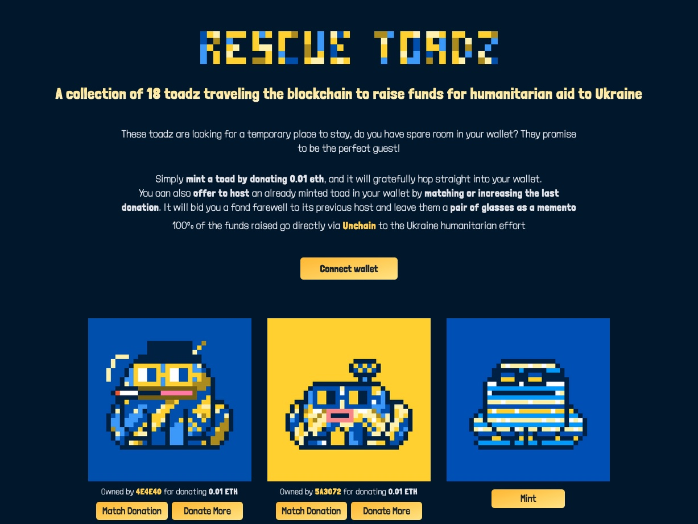

# Rescue Toadz

## A collection of 18 toadz traveling the blockchain to raise funds for humanitarian aid to Ukraine

### These toadz are looking for a temporary place to stay, do you have spare room in your wallet? They promise to be the perfect guest!

Simply **mint a toad by donating 0.01 eth**, and it will gratefully hop straight into your wallet.
You can also **offer to host** an already minted toad in your wallet by **matching or increasing the last donation**. It will bid you a fond farewell to its previous host and leave them a **pair of glasses as a memento**.

### 100% of the funds raised go directly via Unchain to the Ukraine humanitarian effort

## [https://rescuetoadz.xyz/](https://rescuetoadz.xyz/).

## Repository

This repository contains the code for the [smart contract](contract/) and the [React website](website/).
